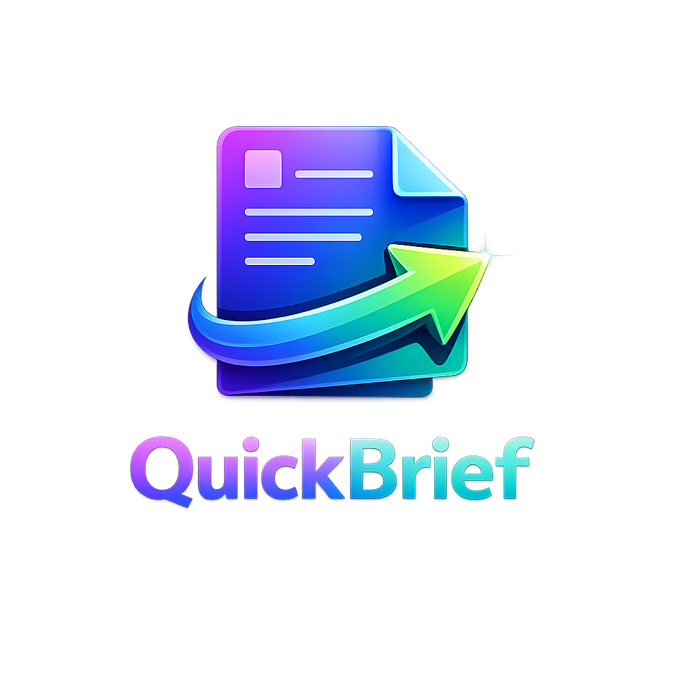

<div align="center">



# QuickBrief

**Professionelle Musterbriefe in 30 Sekunden.**

Kündigung, Beschwerde, Widerruf & mehr — kostenlos, DIN 5008 konform, sofort druckbar.

[](https://beko2210.github.io/QuickBrief/)
[](https://beko2210.github.io/QuickBrief/)
[](https://beko2210.github.io/QuickBrief/)

---


</div>

---

## Was ist QuickBrief?

QuickBrief ist eine kostenlose Web-App, mit der du in wenigen Klicks **professionelle Briefe** erstellst — rechtssicher formuliert und perfekt formatiert fürs Klarsichtfenster. Kein Login, keine Registrierung, keine Daten die dein Gerät verlassen.

### Brieftypen

| Typ | Beschreibung |
|-----|-------------|
| **Kündigung** | Verträge, Abos & Mitgliedschaften fristgerecht kündigen |
| **Widerruf** | Online-Käufe innerhalb der 14-Tage-Frist zurücknehmen (§ 355 BGB) |
| **Beschwerde** | Professionell reklamieren bei Service- oder Produktproblemen |
| **Widerspruch** | Formell gegen Bescheide, Rechnungen oder Entscheidungen vorgehen |
| **Mängelanzeige** | Vermieter über Mängel informieren & Beseitigung fordern (§ 536 BGB) |
| **Fristsetzung** | Fristen für ausstehende Leistungen, Zahlungen oder Reparaturen setzen |

---

## Features

- **6 Brieftypen** — Die häufigsten rechtlichen Schreiben abgedeckt
- **DIN 5008 konform** — Perfekt formatiert für den Druck mit Klarsichtfenster
- **Sofort druckbar** — Ein Klick, fertig. Optimiert für A4-Druck
- **100% kostenlos** — Keine versteckten Kosten, kein Premium, kein Abo
- **Datenschutz-first** — Alle Daten bleiben lokal in deinem Browser
- **Offline-fähig** — Als PWA installierbar, funktioniert ohne Internet
- **Mobile First** — Optimiert für Smartphone, Tablet & Desktop
- **Dark Mode** — Modernes, augenfreundliches Design
- **Keine Registrierung** — Sofort loslegen, kein Account nötig
- **Tastenkürzel** — `Strg + Enter` zum schnellen Erstellen

---

## Installation als App

QuickBrief ist eine **Progressive Web App (PWA)** und kann wie eine native App installiert werden:

### Android
1. Öffne [QuickBrief](https://beko2210.github.io/QuickBrief/) in Chrome
2. Tippe auf das **Banner** oder das Menü `⋮` → *„App installieren"*
3. QuickBrief erscheint als App auf deinem Homescreen

### iOS (iPhone / iPad)
1. Öffne [QuickBrief](https://beko2210.github.io/QuickBrief/) in Safari
2. Tippe auf **Teilen** → *„Zum Home-Bildschirm"*
3. Bestätige mit *„Hinzufügen"*

### Desktop (Windows / macOS / Linux)
1. Öffne [QuickBrief](https://beko2210.github.io/QuickBrief/) in Chrome oder Edge
2. Klicke auf das **Install-Icon** in der Adressleiste (oder Menü → *„App installieren"*)
3. QuickBrief öffnet sich als eigenständiges Fenster

> Nach der Installation funktioniert QuickBrief **vollständig offline**.

---

## Technologie

```
Keine Frameworks. Keine Dependencies. Keine Build-Tools.
Eine einzige HTML-Datei mit inline CSS & JavaScript.
```

| Technologie | Verwendung |
|------------|-----------|
| **HTML5** | Semantische Struktur |
| **CSS3** | Animations, Grid, Flexbox, Custom Properties |
| **Vanilla JS** | Briefgenerierung, PWA, Service Worker |
| **Google Fonts** | Cabinet Grotesk, Satoshi, JetBrains Mono |
| **SVG Icons** | Lucide-Style Inline-Icons |
| **Service Worker** | Offline-Cache & App-Installation |

---

## Projektstruktur

```
QuickBrief/
├── index.html              # Redirect → quickbrief.html
├── quickbrief.html          # Haupt-App (Single File)
├── manifest.json            # PWA Web App Manifest
├── sw.js                    # Service Worker (Offline-Cache)
├── README.md
├── assets/
│   └── icon.png             # Original Logo (1024×1024)
└── icons/
    ├── favicon-16x16.png
    ├── favicon-32x32.png
    ├── icon-72x72.png
    ├── icon-96x96.png
    ├── icon-128x128.png
    ├── icon-144x144.png
    ├── icon-152x152.png
    ├── icon-192x192.png
    ├── icon-384x384.png
    ├── icon-512x512.png
    └── apple-touch-icon.png
```

---

## Lokale Entwicklung

Da QuickBrief keine Build-Tools benötigt, reicht ein einfacher HTTP-Server:

```bash
# Python
python -m http.server 8000

# Node.js
npx serve .

# PHP
php -S localhost:8000
```

Dann öffne `http://localhost:8000` im Browser.

> **Hinweis:** Für die Service-Worker-Funktionalität ist ein HTTP-Server erforderlich (nicht `file://`).

---

## Datenschutz & Rechtliches

- **Keine Cookies** — Null. Nada.
- **Kein Tracking** — Kein Google Analytics, kein Matomo, nichts.
- **Keine Server-Verarbeitung** — Alle Formulardaten bleiben in deinem Browser.
- **localStorage** — Nur ein anonymer Zähler, keine personenbezogenen Daten.
- **DSGVO-konform** — Impressum & Datenschutzerklärung integriert.

---

## Lizenz & Kontakt

Erstellt von **Belkis Aslani**

[](https://github.com/BEKO2210)
[](https://x.com/XxBeko88xX)
[](https://www.instagram.com/_b_to_the_kiss_/)

---

<div align="center">

**[QuickBrief starten](https://beko2210.github.io/QuickBrief/)**

*Die generierten Musterbriefe dienen als Formulierungshilfe und ersetzen keine individuelle Rechtsberatung.*

</div>
